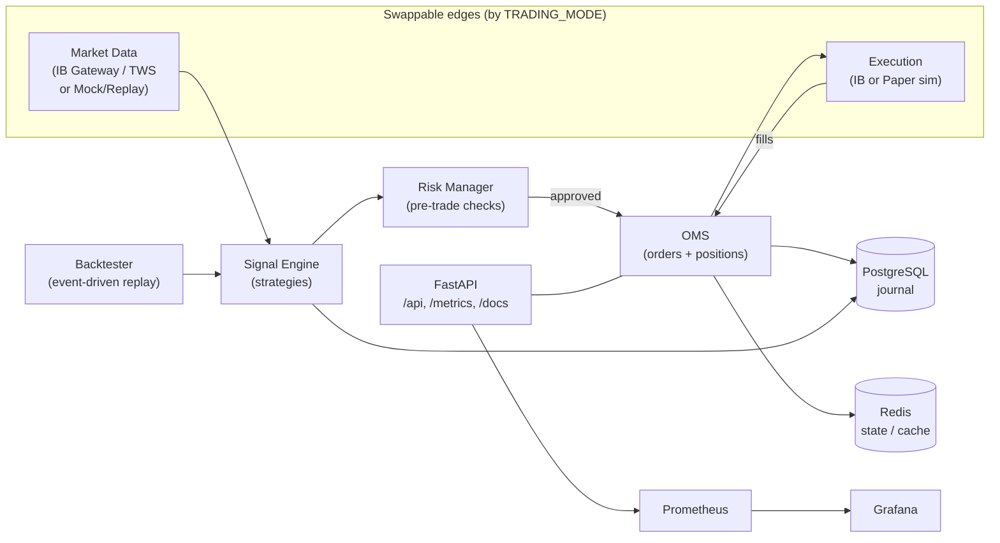

# Architecture

The platform is built around a single trading pipeline that is reused identically
across **backtest**, **paper** and **live** modes. Only the edges (market-data
source and execution venue) are swapped via a factory, so a strategy validated in
backtest runs unchanged in production.

## Pipeline

1. **Market Data** — `MarketDataProvider` interface. `IBMarketDataProvider`
   (ib_insync, IB Gateway/TWS) for paper/live; `MockMarketDataProvider` for
   deterministic backtests, tests and demos.
2. **Signal Engine** — `Strategy` interface. Ships with `SMACrossover`; add new
   strategies by implementing `on_bars()`.
3. **Risk Manager** — every order passes pre-trade checks: max order qty, max
   position USD, daily-loss kill switch. Rejections are counted in Prometheus.
4. **OMS** — single source of truth for orders and positions; blends average
   price on fills, journals to Postgres.
5. **Execution** — `ExecutionGateway` interface. `PaperExecutionGateway`
   simulates fills with configurable slippage; `IBExecutionGateway` routes real
   orders through IB.
6. **Backtester** — replays historical bars through the *same* signal → risk →
   OMS path, producing an equity curve and trade stats.

## Observability

FastAPI exposes `/metrics` (Prometheus). Grafana visualises signals generated,
orders submitted/rejected, open positions and market-data latency. All actions
are logged as structured JSON (structlog) and journaled to Postgres.

## Modes

| TRADING_MODE | Market data | Execution      | Use |
|--------------|-------------|----------------|-----|
| `mock`       | Mock        | Paper sim      | Local dev / CI / demo |
| `paper_ib`   | IB paper    | Paper sim      | Strategy validation on real data |
| `live`       | IB          | IB             | Production (real account) |
